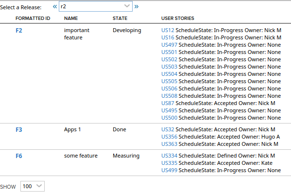
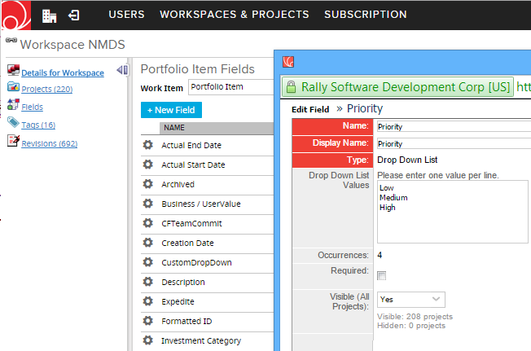
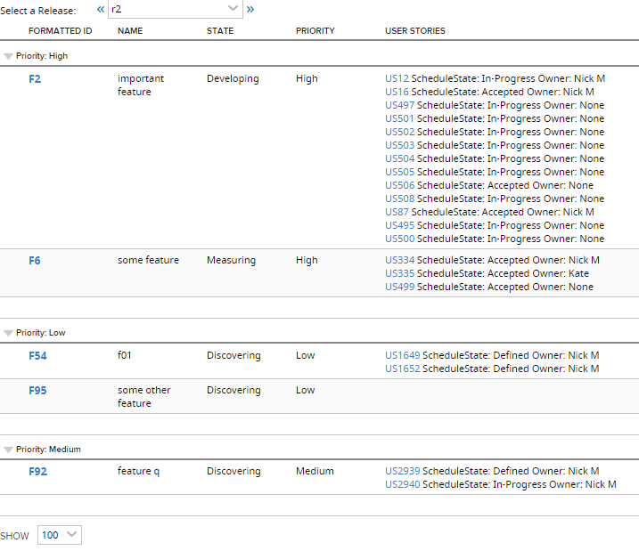

Features by Release with Stories
=========================

## Overview

The app was developed further to add a 'Property' column based on a custom field of dropdown type: Property.
In this workspace, objects of PortfolioItem type have custom field Property:

The Features also grouped by the Property field:

This app is vailable AS IS. It is NOT supported by Rally.

## License

AppTemplate is released under the MIT license.  See the file [LICENSE](./LICENSE) for the full text.

##Documentation for SDK

You can find the documentation on our help [site.](https://help.rallydev.com/apps/2.0rc3/doc/)
